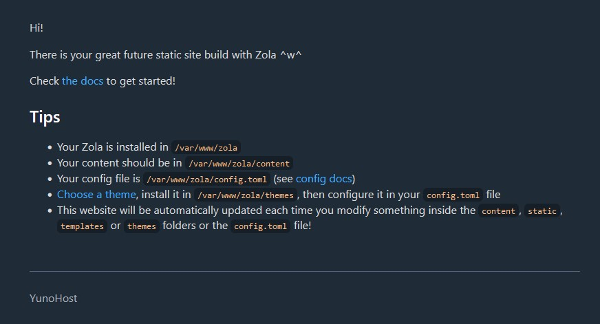

<!--
NOTA: Este README foi creado automáticamente por <https://github.com/YunoHost/apps/tree/master/tools/readme_generator>
NON debe editarse manualmente.
-->

# Zola para YunoHost

[](https://ci-apps.yunohost.org/ci/apps/zola/)


[](https://install-app.yunohost.org/?app=zola)

*[Le este README en outros idiomas.](./ALL_README.md)*

> *Este paquete permíteche instalar Zola de xeito rápido e doado nun servidor YunoHost.*  
> *Se non usas YunoHost, le a [documentación](https://yunohost.org/install) para saber como instalalo.*

## Vista xeral

Zola is a [Static Site Generator](https://en.wikipedia.org/wiki/Static_site_generator).

With this package, Zola will automatically regenerate ([using Systemd Path Units](https://www.putorius.net/systemd-path-units.html)) your website if any change is made to your sources.


**Versión proporcionada:** 0.20.0~ynh1

## Capturas de pantalla



## Documentación e recursos

- Web oficial da app: <https://www.getzola.org/>
- Documentación oficial para admin: <https://www.getzola.org/documentation/getting-started/overview/>
- Repositorio de orixe do código: <https://github.com/getzola/zola>
- Tenda YunoHost: <https://apps.yunohost.org/app/zola>
- Informar dun problema: <https://github.com/YunoHost-Apps/zola_ynh/issues>

## Info de desenvolvemento

Envía a túa colaboración á [rama `testing`](https://github.com/YunoHost-Apps/zola_ynh/tree/testing).

Para probar a rama `testing`, procede deste xeito:

```bash
sudo yunohost app install https://github.com/YunoHost-Apps/zola_ynh/tree/testing --debug
ou
sudo yunohost app upgrade zola -u https://github.com/YunoHost-Apps/zola_ynh/tree/testing --debug
```

**Máis info sobre o empaquetado da app:** <https://yunohost.org/packaging_apps>
